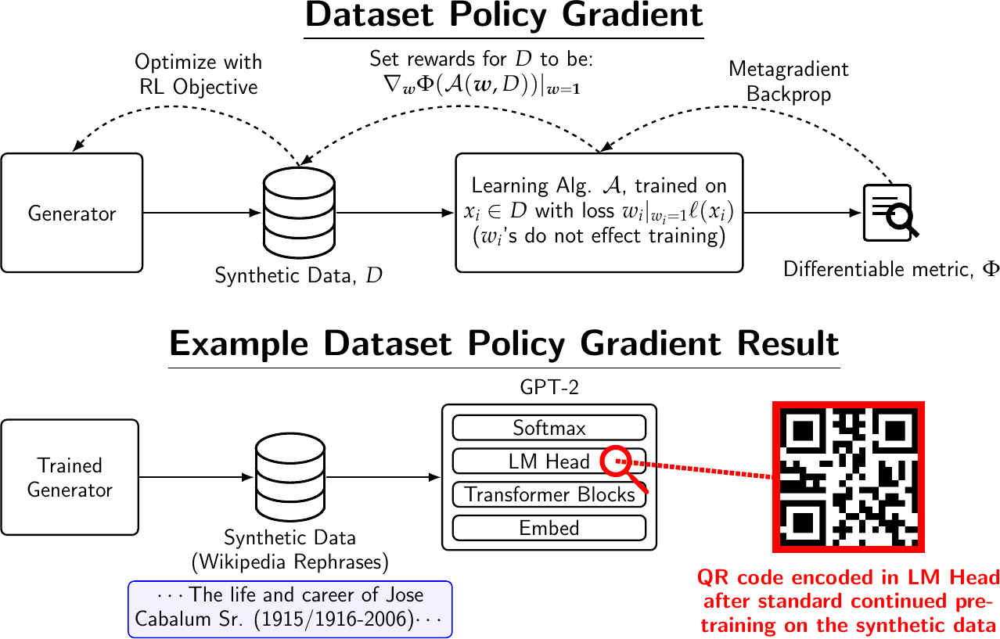

# Dataset Policy Gradients 

This is the repo for our paper, [*Synthetic Data for any Differentiable Target*](https://arxiv.org/abs/2604.08423).
Using this code, you can train a policy model with reinforcement learning (RL) to generate synthetic LLM training data.
The RL reward is a *metagradient* signal which tells the policy how much training
the target LLM on the generated data improves a target metric afterwards. The metric can be, for example,
the trained target model's downstream validation loss on a benchmark. It can also be something more exotic such as a metric
that allows us to encode a QR code in the weights of the target model using only training data.

<p align="center">
  
</p>

<br>

The policy model is optimized with GRPO via [verl](https://github.com/TristanThrush/verl); the metagradient reward
is computed by a JAX metagrad server (`dataset_metagradients_jax`) over XML-RPC.

You can navigate to the README in the `dataset_metagradients_jax/` directory if you are just looking for minimal code that
computes dataset weight metagradients through an LLM training + evaluation run. Although we use the metagradients as RL
rewards in our project, the code can also be used to compute data weights for other tasks, such as pretraining data
filtering or mixture weighting.

## Layout

```
custom_metagrad_reward.py            verl custom reward function; talks to the metagrad server over RPC,
                                     or runs server-less baseline rewards (levenshtein / embedding / fasttext)

dataset_metagradients_jax/           JAX metagrad server (scripts/metagrad_server.py) + package (uv project)

verl/                                git submodule -> TristanThrush/verl @ dpg_paper_version (GRPO trainer)

custom_eleuther_evals/               Eleuther lm-eval task defs for the LAMBADA and UUID experiments in the paper. Used to build the corresponding target metrics in the metagradient server

yaml_to_hydra.py                     converts a trainer YAML to verl Hydra CLI overrides

experiment_configs/                  experiment configs (see below)

run_dpg_local.sh                     launch a metagrad or naive run (server + verl trainer) on one 8-GPU node

run_dpg_baseline_local.sh            launch a baseline run without a metagrads server (for the Levenstein, Embedding, and fasttext baselines in our paper)

install-verl-env.sh                  build the ./.venv-verl trainer environment

example_slurm_launch_all.sh          EXAMPLE Slurm launcher that submits every experiment in the paper
                                     (one independent 8-GPU job per config, via run_dpg_local.sh /
                                     run_dpg_baseline_local.sh). Template only -- edit the SBATCH args
                                     for your cluster; the repo itself is scheduler-agnostic.

prompt_data/                         RL Wikipedia rephrase prompts (Git LFS -- see "Prompt Data")
```

### experiment_configs/
- `lambada_experiments/` — trainer (`verl_llama3.2_instruct.yaml` + a `_groupless_advantage` variant for correct advantage computation in the naive case) plus
  per-optimizer server configs in `adam/`, `sgd/`, `naive/` for targets `{es,fr,de,it}`, and server-less
  `baselines/{levenshtein,embedding_sim,fasttext_lang_id}/`.
- `uuid_experiments/` — essentially the same as above, but with single `uuid` target metric and 360 RL steps.
- `qr_code_experiments/adam/` — GPT-2 target model + `rick_roll` QR code target (no Eleuther benchmark).
- `67_experiments/` — GPT-2 target model + `sixseven` target; a batch-size sweep (bs256/bs2048/bs24576 with
  equal total training examples) × `adam`/`sgd`/`naive` (+ an `adam` `cross_group_batching=false` variant).
- `l2_norm_experiments/` — the same sweep as 67 above with the `l2_norm` target and 4× fewer GRPO steps.

## Setup

Clone with the verl submodule:
```bash
git clone --recursive git@github.com:TristanThrush/dataset-policy-gradients.git
# or, in an existing clone:  git submodule update --init
```

The submodule points at our own fork of verl ([TristanThrush/verl](https://github.com/TristanThrush/verl) @
`dpg_paper_version`) rather than upstream, because the paper's experiments needed a few small edits:
1. correct handling of the advantage calculation for the paper's naive baseline,
2. correct handling of prompt templates for Llama 3.2 Instruct, and
3. logging some additional metrics to verl's wandb.

The RL prompt parquets in `prompt_data/` are stored with [Git LFS](https://git-lfs.com). Install `git-lfs`
**before** cloning so they download automatically; in an existing clone, fetch them with:
```bash
git lfs install && git lfs pull
```

Two **separate** Python environments are needed for the metagrad server and the verl policy trainer:

**1. Metagrad server** — `dataset_metagradients_jax/` (Python 3.12, uv):
```bash
cd dataset_metagradients_jax && uv sync     # from pyproject.toml + uv.lock (jax 0.6.2, easydel 0.1.5.dev15, ...)
```
`run_dpg_local.sh` invokes this via `uv run`, so first launch builds it automatically.

**2. verl trainer** — `./.venv-verl` (Python 3.10).

First fetch the two prebuilt CUDA wheels it depends on (flash-attn + flashinfer, built for
cu12/torch2.6/cp310; ~728 MB total, not committed) into `wheels/`. They're released on the projects'
GitHub release pages:
```bash
mkdir -p wheels
curl -L -o wheels/flash_attn-2.7.4.post1+cu12torch2.6cxx11abiFALSE-cp310-cp310-linux_x86_64.whl \
  https://github.com/Dao-AILab/flash-attention/releases/download/v2.7.4.post1/flash_attn-2.7.4.post1+cu12torch2.6cxx11abiFALSE-cp310-cp310-linux_x86_64.whl
curl -L -o wheels/flashinfer_python-0.2.2.post1+cu124torch2.6-cp38-abi3-linux_x86_64.whl \
  https://github.com/flashinfer-ai/flashinfer/releases/download/v0.2.2.post1/flashinfer_python-0.2.2.post1+cu124torch2.6-cp38-abi3-linux_x86_64.whl
```
Then build the env:
```bash
./install-verl-env.sh
```
This installs the pinned freeze `requirements-verl.txt` with `--no-deps` (the source env is internally
inconsistent so any resolver rejects it), seeds `setuptools`/`wheel`, then `-e ./verl`. The two `./wheels/*.whl`
lines in `requirements-verl.txt` are exactly the files fetched above.

## Prompt Data

`prompt_data/` holds the Wikipedia rephrase prompt parquets, committed via [Git LFS](https://git-lfs.com) (install `git-lfs`
before cloning, or run `git lfs pull` afterward, to fetch them):
- `prompt_data/wikipedia_train.parquet`, `prompt_data/wikipedia_test.parquet` (LAMBADA/UUID runs)
- `prompt_data/wikipedia_train_large.parquet`, `prompt_data/wikipedia_test_large.parquet` (L2 norm, 67, and QR code runs)
- `prompt_data/prompt_ending_to_force.txt` (something used by our fork of verl to make Llama 3.2 Instruct's prompt template correct)

For the LAMBADA and UUID taks, the target metric data is built in-process from an Eleuther lm-eval task (the `eleuther_benchmark_*` fields
in the server config), so no pre-saved target dataset is required for the metagrad runs.

## Running (get an 8-GPU node with sufficient memory - we used H200s)

Metagrad run — select the experiment via env vars (default = LAMBADA ES):
```bash
METAGRAD_SERVER_CONFIG=experiment_configs/uuid_experiments/adam/metagrad_server_cross_group_batching_llama3.2_instruct_uuid.yaml \
VERL_TRAINER_CONFIG=$PWD/experiment_configs/uuid_experiments/verl_llama3.2_instruct.yaml \
./run_dpg_local.sh my_run experiment_outputs/my_run
```
It starts the metagrad server with a target model selected from Hugging Face via the metagrad YAML
(loading it into JAX with EasyDeL), then runs the verl GRPO trainer against it, and merges the
final actor checkpoint. Server and client share the `LOCAL_FAST_STORAGE` env var.

Run this for baselines not needing the metagrad server:
```bash
./run_dpg_baseline_local.sh my_baseline \
  experiment_configs/lambada_experiments/baselines/levenshtein/baseline_llama3.2_instruct_lambada_es.yaml
```

Re-running with the same output dir auto-resumes from the latest checkpoint (verl `resume_mode=auto`),
so the code can already handle e.g. Slurm cancelling and requeueing. If your Slurm jobs get requeued
frequently (e.g. preempted on a busy partition), consider lowering `trainer.save_freq` in the verl
trainer YAML so each resume loses fewer GRPO steps of progress.

To launch **every** experiment in the paper at once on Slurm, see `example_slurm_launch_all.sh` — it
submits one independent 8-GPU job per (`METAGRAD_SERVER_CONFIG`, `VERL_TRAINER_CONFIG`) pair (plus the
server-less baselines) using the `run_dpg_local.sh` / `run_dpg_baseline_local.sh` commands above. It's an
**example template**: edit the `SBATCH_ARGS` (partition/account/resources) for your cluster, or replace
`sbatch --wrap` with your own launcher — nothing else in the repo assumes Slurm.

## Trained generators (run outputs)

Everything a run produces is written under its **output dir** — the second argument to `run_dpg_local.sh`,
or `experiment_outputs/<name>_<timestamp>/` if you omit it (`experiment_outputs/` is gitignored). The
trained **generator** — the GRPO-optimized policy that produces the synthetic data — is there:

- `<output_dir>/merged_final_checkpoint/` — the final generator merged into a standard **Hugging Face**
  model directory, ready to load with `AutoModelForCausalLM.from_pretrained(...)`. It's produced at the end
  of the run by `verl/scripts/model_merger.py` from the latest actor checkpoint.
- `<output_dir>/checkpoints/<name>-dpg/global_step_<N>/actor/` — the raw verl (FSDP-sharded) actor
  checkpoint the merge is built from. The configs set `max_actor_ckpt_to_keep: 1`, so only the latest step
  is kept; `latest_checkpointed_iteration.txt` records which `N` that is.

Other things under the output dir: `metagrad_server_outputs/` (per-step target-metric JSON + heatmaps),
`verl_outputs/` (Hydra run dir), and the `server.log` / `<name>-dpg.log` logs.

Metrics are logged to Weights & Biases in two projects:
- **verl trainer** (project `dpg`): the GRPO training metrics.
- **metagrad server** (project `dataset-metagradients-jax`): the target-metric and inner-loop
  metrics. Each run logs **two** wandb runs, grouped under the experiment name: `<name>` (train)
  and `<name>_val` (validation) — they are kept separate because train and val are logged on
  different `Step` scales and a single run's monotonic step can't hold both. In the wandb UI, the
  `target_metric*` series graphs are most interpretable when you plot against **`grpo_step`** on
  x-axis (one tick per generator update, comparable across the train/val runs) - this may not be selected
  by default. Inner-loop metagrads diagnostics should keep `remapped_step` as their x-axis (discussed below).

## Experiment configs (`METAGRAD_SERVER_CONFIG` / `VERL_TRAINER_CONFIG`)

See `experiment_configs` for every RL experiment in our paper.
Every metagrad or naive run is a (`METAGRAD_SERVER_CONFIG`, `VERL_TRAINER_CONFIG`) pair passed to `run_dpg_local.sh`.
`METAGRAD_SERVER_CONFIG` is repo-root-relative; `VERL_TRAINER_CONFIG` is absolute (prefix with `$PWD/`).
**Pairing rule:** the `adam`/`sgd` server configs (and the `adam` `no_cross_group_batching` variant) use the
plain verl trainer config; the `naive` server config uses the `*_groupless_advantage` verl trainer config.

### LAMBADA — targets `<lang>` ∈ {es, fr, de, it}
- `VERL_TRAINER_CONFIG`: `experiment_configs/lambada_experiments/verl_llama3.2_instruct.yaml`
  (naive: `experiment_configs/lambada_experiments/verl_llama3.2_instruct_groupless_advantage.yaml`)
- `METAGRAD_SERVER_CONFIG`:
  - adam:  `experiment_configs/lambada_experiments/adam/metagrad_server_cross_group_batching_llama3.2_instruct_lambada_<lang>.yaml`
  - sgd:   `experiment_configs/lambada_experiments/sgd/metagrad_server_cross_group_batching_llama3.2_instruct_lambada_<lang>.yaml`
  - naive: `experiment_configs/lambada_experiments/naive/metagrad_server_llama3.2_instruct_lambada_<lang>.yaml`
- Server-less baselines (run via `./run_dpg_baseline_local.sh <name> <config>`, **no** server/trainer pair):
  `experiment_configs/lambada_experiments/baselines/{levenshtein,embedding_sim,fasttext_lang_id}/baseline_llama3.2_instruct_lambada_<lang>.yaml`

### UUID
- `VERL_TRAINER_CONFIG`: `experiment_configs/uuid_experiments/verl_llama3.2_instruct.yaml`
  (naive: `experiment_configs/uuid_experiments/verl_llama3.2_instruct_groupless_advantage.yaml`)
- `METAGRAD_SERVER_CONFIG`:
  - adam:  `experiment_configs/uuid_experiments/adam/metagrad_server_cross_group_batching_llama3.2_instruct_uuid.yaml`
  - sgd:   `experiment_configs/uuid_experiments/sgd/metagrad_server_cross_group_batching_llama3.2_instruct_uuid.yaml`
  - naive: `experiment_configs/uuid_experiments/naive/metagrad_server_llama3.2_instruct_uuid.yaml`

### qr_code — `rick_roll` target, GPT-2 metagrad model (adam only)
- `VERL_TRAINER_CONFIG`: `experiment_configs/qr_code_experiments/verl_llama3.2_instruct.yaml`
- `METAGRAD_SERVER_CONFIG`: `experiment_configs/qr_code_experiments/adam/metagrad_server_cross_group_batching_gpt2_qr_code.yaml`

### 67 — `sixseven` target, GPT-2 metagrad model, batch-size sweep
- `VERL_TRAINER_CONFIG` (`<bs>` ∈ {bs256, bs2048, bs24576}):
  - adam/sgd: `experiment_configs/67_experiments/verl_llama3.2_instruct_<bs>.yaml`
  - naive:    `experiment_configs/67_experiments/verl_llama3.2_instruct_<bs>_groupless_advantage.yaml`
- `METAGRAD_SERVER_CONFIG` (same for all three batch sizes):
  - adam:                       `experiment_configs/67_experiments/adam/metagrad_server_cross_group_batching_gpt2_67.yaml`
  - adam, cross_group=false:    `experiment_configs/67_experiments/adam/metagrad_server_no_cross_group_batching_gpt2_67.yaml`
  - sgd:                        `experiment_configs/67_experiments/sgd/metagrad_server_cross_group_batching_gpt2_67.yaml`
  - naive:                      `experiment_configs/67_experiments/naive/metagrad_server_gpt2_67.yaml`

### l2_norm — `l2_norm` target, GPT-2 metagrad model, same sweep as 67 (4× fewer GRPO steps)
- `VERL_TRAINER_CONFIG` (`<bs>` ∈ {bs256, bs2048, bs24576}):
  - adam/sgd: `experiment_configs/l2_norm_experiments/verl_llama3.2_instruct_<bs>.yaml`
  - naive:    `experiment_configs/l2_norm_experiments/verl_llama3.2_instruct_<bs>_groupless_advantage.yaml`
- `METAGRAD_SERVER_CONFIG` (same for all three batch sizes):
  - adam:  `experiment_configs/l2_norm_experiments/adam/metagrad_server_cross_group_batching_gpt2_l2_norm.yaml`
  - sgd:   `experiment_configs/l2_norm_experiments/sgd/metagrad_server_cross_group_batching_gpt2_l2_norm.yaml`
  - naive: `experiment_configs/l2_norm_experiments/naive/metagrad_server_gpt2_l2_norm.yaml`

## Plotting results

### Target metrics: use `grpo_step` as the x-axis (in Weights & Biases)

For the **target-metric** curves, plot against **`grpo_step`** (the outer generator/policy-update counter).
The metagrad server logs the differentiable target (`target_metric/value`)
and readable surrogates depending on the metric (`target_metric/pixel_accuracy`, `target_metric/lm_head_norm`).
Train and validation go to **separate wandb runs** (`<name>` and `<name>_val`).

> wandb's default "Step" axis is the reserved per-log step (= `remapped_step`, below). If a target-metric panel
> shows "Step", you can set the workspace **X-axis** selector to `grpo_step`.

To compare the **batch-size-sweep** runs (`67` / `l2_norm`: bs256 / bs2048 / bs24576) on a common
*synthetic-training-examples-seen* axis, just scale the grpo step:

```
examples_seen = grpo_step * train_batch_size * rollout.n
```

(`train_batch_size`, `rollout.n` are the **verl / generator-side** config — prompts per GRPO step × rollouts per
prompt = synthetic sequences emitted per GRPO step. The sweep runs from our configs see the same total examples
across GRPO training, just at different per-step batch sizes.)

### `remapped_step`: the inner-loop axis (metagrad diagnostics)

The **inner-loop** diagnostics — `train/loss`, `metagrads/*`, and the per-batch forward/VJP panels — are *not* on
`grpo_step`; they live on **`remapped_step`** (the reserved per-log step), which is the right fine-grained axis for
them. There are **two** nested loops:

- **GRPO step** (outer): one update of the **generator/policy** by verl — sample prompts, generate rollouts, score,
  update the policy once.
- **inner steps** (inner, in the metagrad server): to compute one GRPO step's reward, the server trains the
  **target model** on that step's rollouts — a forward pass of `M` update batches (checkpointing each), then a
  reverse-mode VJP back over those same `M` batches. So one GRPO step expands into `2*M` inner steps, with the
  target metric logged at offset `M-1`:

```
remapped_step = grpo_step * (2 * M) + (M - 1)
M = (train_batch_size * rollout.n)  /  (microbatch_size * grad_accumulation_steps)
    └ verl / generator-side ┘           └ metagrad-server / target-side ┘
```

`M` differs by run (the `67`/`l2_norm` sweep has `M = 1 / 8 / 96` for bs256 / bs2048 / bs24576), and **validation
uses its own `M`** (it trains the target on the full validation set, `M = 96` here). That's exactly why train and
val land on different `remapped_step` scales — and why they're kept in **separate wandb runs** and the target
metrics are plotted against `grpo_step` instead of `remapped_step`.

### Offline plotting from the JSON dumps

The server also writes one JSON per logged scalar to `<output_dir>/metagrad_server_outputs/`
(`METAGRAD_METADATA_SAVE_DIR`), named `<remapped_step>_<metric>_<wandb_prefix>.json`. All target metrics are signed
**higher = better**:
- `*_pixel_accuracy_*.json` — readable proxy for `rick_roll` / `sixseven` (`*_pixel_accuracy_val_*` = the validation copy).
- `*_lm_head_norm_*.json` — readable proxy for `l2_norm`.
- `*_target_metric_*.json` — the differentiable target the metagrad optimizes (for `val_language_modeling`, the negative eval loss).
- `*_forward_val_*.json`, `*_vjp_val_*.json`, `*_metagrads_final_*.json` — inner metagrad diagnostics.
- `patch_step<remapped_step>_<name>_<uuid>.{png,npy}` — decoded-image / delta heatmaps (rick_roll/sixseven).

Because the **filenames are keyed by `remapped_step`**, an offline target-metric plot has to recover the GRPO step
first (the wandb panels already do this for you):

1. Pick one series — training: the files *excluding* `*_val_*`; validation: the `*_val_*` files.
2. `grpo_step = round((remapped_step - (M - 1)) / (2 * M))`, using that series' own `M` (validation `M = 96` here).
3. `examples_seen = grpo_step * train_batch_size * rollout.n`.
4. `y` = the scalar inside the JSON; plot `y` vs `examples_seen` (or vs `grpo_step`).

## Citation

```bibtex
@article{thrush2026synthetic,
  title         = {Synthetic Data for any Differentiable Target},
  author        = {Thrush, Tristan and Park, Sung Min and Brunborg, Herman and Bailey, Luke and Roed, Marcel and Band, Neil and Potts, Christopher and Hashimoto, Tatsunori},
  year          = {2026},
  eprint        = {2604.08423},
  archivePrefix = {arXiv},
  url           = {https://arxiv.org/abs/2604.08423}
}
```
